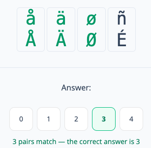

# Perceptual Speed Game

## About

A web game that measures **perceptual speed** — the cognitive skill of rapidly
comparing visual symbols under time pressure.

Each round shows two short rows of glyphs (uppercase vs. lowercase, hiragana
vs. katakana, or emoji pairs like 🥚 ↔ 🐣). You count how many vertical positions hold the **same letter**
(case-insensitive) and pick a number from 0 to 4. The game tracks both accuracy
and time.

- **Count mode** — play a fixed number of rounds (5 / 10 / 15 / 20 / 30) and get
  scored on correct answers plus total time.
- **Time mode** — answer as many rounds as you can within a time limit
  (10s / 30s / 60s / 120s); rounds keep generating until the clock runs out.
- **Letter systems** — English, German (with umlauts), Accented (Nordic /
  Romance), Greek, Cyrillic, Japanese Kana, and Emoji (🥚 ↔ 🐣, 🐛 ↔ 🦋, …).
- **Matching Pairs reference** — a "show pairs" page (reachable from Options)
  displays every pair in the currently selected letter system, so you can study
  the set — especially useful for Kana and Emoji — before playing.
- **Review** — after a game, step through each round to see the correct answer
  and your pick side by side.
- **Records** — past game results are saved locally and viewable on the Records
  screen, sorted by recency. Includes mode, letter system, score, and timestamp.
  You can clear all records at any time.
- **Localized** — UI available in 14 languages: English, Danish, German,
  Spanish, French, Portuguese, Indonesian, Russian, Chinese, Japanese, Hindi,
  Bengali, Arabic (RTL), and Urdu (RTL). Your settings are saved between
  sessions.

## Demo

**Live:** <https://kunukn.github.io/perceptual-speed-game/>

Scan to play on your phone:


Screenshot:



## How to Play

- Each round shows two rows of 4 letters — one row uppercase, one lowercase.
- Count how many vertical pairs are the **same letter** (case-insensitive).
- Pick the count (0–4).
- 10 rounds per game. You're scored on correct answers and total time.

## Getting Started

**Prerequisites:** Node.js >= 24, pnpm 11.

```bash
pnpm install
pnpm dev      # start the Vite dev server (http://localhost:5173)
```

## Scripts

| Script           | Description                                    |
| ---------------- | ---------------------------------------------- |
| `pnpm dev`       | Start the Vite dev server                      |
| `pnpm build`     | Type-check (`tsc -b`) and build for production |
| `pnpm preview`   | Preview the production build locally           |
| `pnpm lint`      | Run Oxlint                                     |
| `pnpm typecheck` | Run the TypeScript compiler                    |
| `pnpm format`    | Format `src` with Prettier                     |

## Tech Stack

React 19 · TypeScript · Vite · Tailwind CSS 4 · Emotion · shadcn/Radix UI · Zustand · XState.

## Deployment

Pushing to `main` auto-deploys to GitHub Pages via GitHub Actions
(`.github/workflows/deploy.yml`). `VITE_BASE_PATH` sets the project subpath at build time.

## License

This project is open source under the [0BSD License](LICENSE). _do what you want, but don't blame me._
